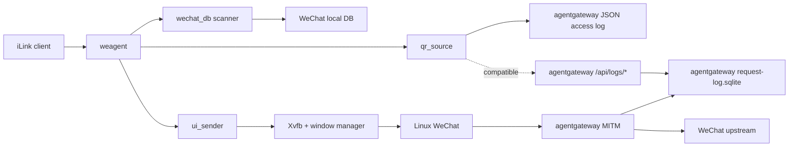

# 架构

`webox` 的目标不是复刻 WechatOnCloud，也不是内置一个通用消息中台。它只解决一个问题：

> 在单个容器里运行 Linux WeChat，并把这个真实客户端投影成标准 iLink 接口。

## 第一性原理

1. 对外契约只有 iLink。
   第三方 AI agent 不应该知道 WOC、tinybridge、msghub 或 `/agent/*`。

2. WeChat Linux 客户端是真实终端。
   发消息通过 UI 自动化驱动客户端；收消息从 WeChat 本地 DB 解密读取。

3. agentgateway 只负责登录二维码 MITM 捕获。
   它不是业务消息通道，也不参与收发消息语义。

4. `weagent` 不维护独立消息事实库。
   消息事实源是 WeChat DB；二维码事实源是 agentgateway 日志 API；发送任务初版只需要进程内串行执行。

5. 参考项目只提供证据，不决定架构。
   `woc-agent-rs` 参考 WeChat DB 与 UI 自动化能力；`tinyclaw/msghub` 只参考 iLink 交互形状；`aicat` 不进入核心设计。

## 目标态组件



## 运行边界

- `weagent` 暴露 iLink HTTP API。
- `weagent` 查询 agentgateway capture 数据，返回登录二维码。
- `weagent` 解密并轮询 WeChat 本地 DB，把消息投影成 iLink updates。
- `weagent` 接收 iLink 发送请求，串行调用 UI sender 操作 WeChat 客户端。
- `agentgateway` 只代理 WeChat 登录相关流量并捕获请求/响应。
- Docker entrypoint 只负责启动依赖进程：Display、agentgateway、WeChat、weagent。
- Docker entrypoint 只给 WeChat 进程注入 MITM 代理环境变量，避免 agentgateway 或 weagent 继承代理造成环路。
- Docker entrypoint 做最小进程监督，关键进程退出时让容器失败，由 Docker restart policy 重启。
- WeChat 客户端在镜像构建期内置，容器运行期不下载或更新客户端。

## 非目标

- 不保留 WOC `/agent/init`、`/agent/poll`、`/agent/send` 作为对外 API。
- 不复制 msghub 的 actor/room/message/task 数据库。
- 不把 agentgateway 捕获内容二次写入 weagent 自己的数据库。
- 不从 agentgateway 流量解析普通聊天消息。
- 不引入控制面、租户系统、通用消息中台或 AI runner。

## 数据流

### 登录二维码

```text
WeChat login request/response
  -> agentgateway MITM
  -> agentgateway JSON access log
  -> weagent qr_source
  -> iLink login QR response
```

查询边界：

- 使用官方 `agentgateway` v1.3.1+。
- `agentgateway` admin API 默认只监听容器内 `127.0.0.1:15000`。
- `weagent` 默认读取 agentgateway JSON access log，不直接读取 agentgateway SQLite。
- `/api/logs/search` 和 `/api/logs/get` 保留为兼容路径；实测 v1.3.1 普通 HTTPS MITM 请求不会写入该 API 背后的 log store。
- 请求/响应 body 来自 log attributes 中的 `request.body` / `response.body`；JSON access log 输出的是 base64 原始字节。
- iLink login 接口主响应是 `qrcode` 投影；`event` 保留 agentgateway 原始捕获字段，仅用于诊断。
- `weagent` 只查询和解析，不把捕获结果复制到自己的数据库。

### 收消息

```text
WeChat local DB
  -> wechat_db scanner decrypts and polls new rows
  -> normalize to iLink message.received updates
  -> client pulls through iLink getupdates
```

游标原则：

- 对外只接受 iLink `after_id`，不暴露内部 cursor。
- `update.id` 使用 WeChat 消息时间戳和消息 id 派生的稳定整数，保证第三方 agent 可以按 `after_id` 继续拉取。
- payload 包含 `room`、`message` 和无状态 `context_token`，agent 回复时可以直接把 `context_token` 传给 `/ilink/sendmessage`。
- 服务端不维护独立 ack 状态。
- 如果标准 iLink 明确要求服务端 ack 状态，再增加最小状态；不能预先引入 msghub-style mailbox。

### 发消息

```text
iLink sendmessage
  -> validate target and payload
  -> execute in-process serial send job
  -> ui_sender activates WeChat window
  -> search/open conversation
  -> paste content
  -> click/send
  -> return iLink task view with status=acked
```

初版发送策略：

- 单进程内串行发送，避免多个 UI 操作互相打断。
- 优先使用 `context_token` 中的 room target；没有 token 时接受显式 `room.outbound_target` 或 `room.external_room_id`。
- 不暴露 UI sender receipt；同步执行结果投影成 `send_message` task。
- 文本优先；图片和文件在文本链路跑通后接入。
- 群聊目标必须使用可唯一定位的备注或会话名，否则拒绝发送。
- 仅当需要容器重启后恢复 pending send 时，再增加最小本地 spool。

## Rust 模块划分

```text
weagent
  ilink        HTTP wire protocol and response mapping
  qr_source    query agentgateway capture source
  wechat_db    decrypt and poll WeChat local DB
  ui_sender    xdotool/xclip based send executor
  runtime      startup checks, background loops, graceful shutdown
```

## 实施顺序

1. 移植 `woc-agent-rs` 的 WeChat DB 解密和 UI 发送能力到 `weagent`。
2. 用 Rust 实现 iLink HTTP 外壳，只暴露标准 iLink 和健康检查。
3. 把 WeChat DB scanner 的消息投影成 iLink updates。
4. 把 iLink send 请求接到 UI sender。
5. 接入 agentgateway capture 查询登录二维码。
6. 整理 Dockerfile 和 entrypoint，保证内置 WeChat、权限、Display、代理和 CA 顺序正确。

## 当前硬缺口

- 真实第三方 iLink 客户端兼容性验证。
- 如果第三方客户端要求服务端持久 ack 状态，需要补最小 ack 状态；当前只支持 `after_id` 拉取和无状态 ack 回显。
- Linux WeChat 在目标镜像内的 DB 路径、权限和 ptrace 条件。
- 真实容器内 WeChat 登录后，需要用实际 DB 和 UI 窗口验证 `after_id` 投影是否覆盖同秒多消息边界。
