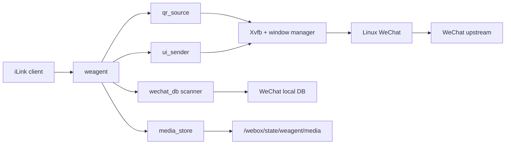

# 架构

`webox` 的目标不是复刻 WechatOnCloud，也不是内置一个通用消息中台。它只解决一个问题：

> 在单个容器里运行 Linux WeChat，并把这个真实客户端投影成标准 iLink 接口。

## 第一性原理

1. 对外契约只有 iLink。
   第三方 AI agent 不应该知道 WOC、tinybridge、msghub 或 `/agent/*`。

2. WeChat Linux 客户端是真实终端。
   发消息通过 UI 自动化驱动客户端；收消息从 WeChat 本地 DB 解密读取。

3. `weagent` 不维护独立消息事实库。
   消息事实源是 WeChat DB；二维码图像事实源是 WeChat 登录窗口；发送任务初版只需要进程内串行执行。

4. 参考项目只提供证据，不决定架构。
   `woc-agent-rs` 参考 WeChat DB 与 UI 自动化能力；`tinyclaw/msghub` 只参考 iLink 交互形状；`aicat` 不进入核心设计。

## 目标态组件



## 运行边界

- `weagent` 暴露 iLink HTTP API。
- `weagent` 从 Xvfb framebuffer 定位并解码 WeChat 登录二维码。
- `weagent` 解密并轮询 WeChat 本地 DB，把消息投影成 iLink updates。
- `weagent` 后台状态机独立完成登录后的 DB key 提取和可读性验证；HTTP 请求不触发初始化。
- `weagent` 接收 iLink 发送请求，文本串行调用 UI sender；二进制媒体发送明确拒绝。
- Docker entrypoint 只负责启动 Display、WeChat 和 weagent。
- WeChat 直接连接上游，不安装 CA、不修改客户端二进制、不注入代理。
- Docker entrypoint 做最小进程监督，关键进程退出时让容器失败，由 Docker restart policy 重启。
- WeChat 客户端在镜像构建期内置，容器运行期不下载或更新客户端。

## 非目标

- 不保留 WOC `/agent/init`、`/agent/poll`、`/agent/send` 作为对外 API。
- 不复制 msghub 的 actor/room/message/task 数据库。
- 不从 WeChat 网络流量解析登录或聊天消息。
- 不把本地媒体上传缓存扩展成通用对象存储或消息附件库。
- 不引入控制面、租户系统、通用消息中台或 AI runner。

## 数据流

### 登录二维码

```text
WeChat login window
  -> Xvfb framebuffer
  -> weagent detects and decodes QR URL
  -> iLink login QR response
```

- `WEBOX_QR_SCREENSHOT_PATH` 指向 Xvfb framebuffer。只有同时检测到 WeChat 蓝色二维码并由 QR 解码器识别成功时才返回登录 URL。
- `GET|POST /ilink/bot/get_bot_qrcode` 返回标准 `qrcode` 和 URL 形式的 `qrcode_img_content`；GET 兼容协议文档，POST 兼容当前 SDK 的 `local_token_list`。
- `GET /ilink/bot/get_qrcode_status` 只读取状态；后台初始化器能读取消息后才返回 `confirmed`。
- 未确认二维码会话的本地 TTL 为 5 分钟；超时或 WeChat 刷新图像后旧 ID 返回 `expired`，下次取码会点击客户端过期二维码刷新区域并重新提取。
- 状态只从本机 WeChat 推导；`binded_redirect`、`need_verifycode` 等远端 iLink 状态不做伪造。
- `confirmed.baseurl` 返回服务根地址，客户端按标准协议拼 `/ilink/bot/*` 端点。
- 登录会话只在内存中保存当前和已确认二维码 ID，确保 Token 只能由实际签发的二维码换取；不保存业务状态库。
- 微信已登录但没有二维码时，只允许 `local_token_list` 含当前持久 token 的客户端恢复连接，未认证请求不能直接换取 token。
- 持久账号启动页由后台状态机自动点击登录；微信要求的手机确认仍保持官方安全边界。
- iLink 客户端没有 `/init` 阶段：扫码并确认后，后台自动完成 key 提取与 DB 验证。

### 收消息

```text
WeChat local DB
  -> wechat_db scanner decrypts and polls new rows
  -> normalize to iLink msgs
  -> client pulls through iLink getupdates
```

游标原则：

- 对外只接受 iLink `get_updates_buf`，不暴露内部 DB cursor。
- `get_updates_buf` 是使用持久 API token 签名的不透明游标，内部按会话和消息分片编码精确 `(create_time, local_id)`；篡改后拒绝读取。
- 首次空游标以当前所有消息表的末尾建立基线，不回放任意历史窗口。
- 扫描会推进所有底层记录的位置，但只投递 `status=3, origin_source=2` 的收到消息，避免把机器人发出的消息再次作为输入。
- DB 解密、WAL 合并和查询共享同一进程锁，多个长轮询及发送后校验不会并发改写解密缓存。
- 每条 `msg` 包含无状态、HMAC 签名的 `context_token`，agent 回复时必须原样传给 `/sendmessage`。
- `msg/notifystart` 和 `msg/notifystop` 接收标准 SDK 生命周期通知，不参与本地 DB 游标。
- 服务端不维护独立 ack 状态。
- 如果标准 iLink 明确要求持久上下文状态，再增加最小状态；不能预先引入 msghub-style mailbox。

### 发消息

```text
iLink sendmessage
  -> validate msg.context_token and text payload
  -> execute in-process serial send job
  -> ui_sender activates WeChat window
  -> Escape, Ctrl+F, paste remark, Return
  -> paste content
  -> Return
  -> verify the exact text from WeChat local DB
  -> return iLink ret=0
```

初版发送策略：

- 单进程内串行发送，避免多个 UI 操作互相打断。
- 只使用 `msg.context_token` 中的 room target；不接受显式 `msg.to_user_id` 直发，避免绕开 iLink 上下文。
- `context_token` 使用 API token 做 HMAC 签名，不维护服务端 token 表。
- 文本发送必须从 WeChat DB 读回目标和文本均精确匹配的新消息后才成功。
- 不暴露 UI sender receipt；同步执行成功返回 `ret=0`。
- `image_item`、`voice_item`、`video_item` 和 `file_item` 明确返回 HTTP 501；外部 URL 作为普通文本发送。
- `msg.client_id` 是发送幂等键；有界内存缓存会拦截 SDK 并发重试，并拒绝同一键对应不同内容，不额外引入应用数据库。
- 语音和输入状态没有可靠 Linux WeChat UI 动作，明确返回不支持，不伪造协议成功。
- 群聊目标必须有备注，否则拒绝发送；UI 搜索后直接用 Return 选择第一个结果。
- 部署方必须保证备注能让目标会话排在第一个搜索结果，weagent 无法从本地联系人库证明 UI 搜索结果唯一。
- 仅当需要容器重启后恢复 pending send 时，再增加最小本地 spool。

### 媒体接收

```text
WeChat local image/video/file
  -> wechat_db reads and decrypts local bytes
  -> media_store encrypts an expiring capability object
  -> getupdates returns a standard iLink media item
  -> client downloads encrypted bytes from /c2c/download
```

边界：

- 只暴露 `/c2c/download`，不提供 `getuploadurl` 或 `/c2c/upload`。
- 本地只保存带 TTL 和总容量限制的入站加密媒体对象。
- 收到的本地图片、视频和文件重新加密为短期 capability URL，作为标准 iLink media item 返回。
- 同一入站媒体按 SHA-256 内容身份复用仍有效的 capability 对象，客户端用旧游标重试不会重复占用缓存容量。
- 普通文件按 `appmsg type=6` 和精确文件名关联 `msg/file`；微信尚未下载时不伪造附件。

## Rust 模块划分

```text
weagent
  config       environment configuration
  ilink        HTTP wire protocol and response mapping
  qr_source    locate and decode QR URL from Xvfb framebuffer
  wechat_state derive login state and coordinate DB access
  wechat_db    decrypt and poll WeChat local DB
  media_store  bounded inbound media download cache
  ui_sender    xdotool/xclip based send executor
```

## 自动初始化状态机

```text
container starts
  -> iLink routes listen immediately
  -> wait for QR scan or activate saved-account login
  -> detect logged-in main window
  -> load and validate persisted DB keys, or extract keys from WeChat memory
  -> validate local DB session state
  -> mark ready and return confirmed
  -> getupdates/sendmessage operate without another init call
```

初始化器是唯一允许提取 key 的组件。二维码状态、`getupdates` 和 `sendmessage` 不会隐式触发扫描，避免请求时延和
多个并发请求重复初始化。ready 状态下每 30 秒低频验证一次 DB key；DB 读取失败会立即清除 ready，初始化器随后重新验证或
从微信内存提取，避免运行中密钥轮换后永久卡在伪 ready 状态。退出登录后 ready 状态也会自动清除。

## 验证状态

- WeChat 4.1.1.7 ARM64 已完成真实容器二维码、登录、内存 key 提取和 15 个本地 DB key 读取验证。
- 标准 `/ilink/bot/getupdates` 已用真实消息验证 `context_token` 和文本投影；精确分片游标有单元与数据库查询回归测试。
- 最新 `corespeed-io/wechatbot` Rust SDK 已对当前候选镜像完成取码和 `wait` 状态轮询验证。
- 待运行验证：当前候选镜像扫码后的自动初始化、真实收消息，以及依次向“小金鱼”“测试群”发送文本。
