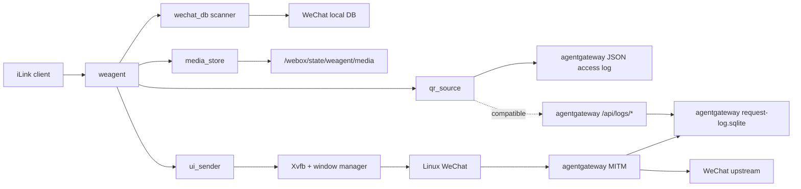

# 架构

`webox` 的目标不是复刻 WechatOnCloud，也不是内置一个通用消息中台。它只解决一个问题：

> 在单个容器里运行 Linux WeChat，并把这个真实客户端投影成标准 iLink 接口。

## 第一性原理

1. 对外契约只有 iLink。
   第三方 AI agent 不应该知道 WOC、tinybridge、msghub 或 `/agent/*`。

2. WeChat Linux 客户端是真实终端。
   发消息通过 UI 自动化驱动客户端；收消息从 WeChat 本地 DB 解密读取。

3. agentgateway 只负责登录二维码 MITM 捕获。
   它不是业务消息通道，也不参与收发消息语义。

4. `weagent` 不维护独立消息事实库。
   消息事实源是 WeChat DB；二维码事实源是 agentgateway JSON access log；发送任务初版只需要进程内串行执行。

5. 参考项目只提供证据，不决定架构。
   `woc-agent-rs` 参考 WeChat DB 与 UI 自动化能力；`tinyclaw/msghub` 只参考 iLink 交互形状；`aicat` 不进入核心设计。

## 目标态组件



## 运行边界

- `weagent` 暴露 iLink HTTP API。
- `weagent` 查询 agentgateway capture 数据，返回登录二维码。
- `weagent` 解密并轮询 WeChat 本地 DB，把消息投影成 iLink updates。
- `weagent` 接收 iLink 发送请求，文本直接串行调用 UI sender，媒体先走本地 CDN shim 上传和解密。
- `agentgateway` 只代理 WeChat 登录相关流量并捕获请求/响应。
- Docker entrypoint 只负责启动依赖进程：Display、agentgateway、WeChat、weagent。
- Docker entrypoint 默认用 `proxychains4` 包住 WeChat 网络进程，避免 Linux WeChat 子进程丢掉普通代理环境变量。
- Docker entrypoint 做最小进程监督，关键进程退出时让容器失败，由 Docker restart policy 重启。
- WeChat 客户端在镜像构建期内置，容器运行期不下载或更新客户端。

## 非目标

- 不保留 WOC `/agent/init`、`/agent/poll`、`/agent/send` 作为对外 API。
- 不复制 msghub 的 actor/room/message/task 数据库。
- 不把 agentgateway 捕获内容二次写入 weagent 自己的数据库。
- 不从 agentgateway 流量解析普通聊天消息。
- 不把本地媒体上传缓存扩展成通用对象存储或消息附件库。
- 不引入控制面、租户系统、通用消息中台或 AI runner。

## 数据流

### 登录二维码

```text
WeChat login request/response
  -> agentgateway MITM
  -> agentgateway JSON access log
  -> weagent qr_source
  -> iLink login QR response
```

查询边界：

- 使用官方 `agentgateway` v1.4.0-alpha.1。
- `agentgateway` admin API 默认只监听容器内 `127.0.0.1:15000`。
- `weagent` 默认读取 agentgateway JSON access log，不直接读取 agentgateway SQLite。
- `/api/logs/search` 和 `/api/logs/get` 保留为兼容路径；实测 v1.4.0-alpha.1 普通 HTTPS MITM 请求不会写入该 API 背后的 log store。
- 请求/响应 body 来自 log attributes 中的 `request.body` / `response.body`；JSON access log 输出的是 base64 原始字节。
- 二维码候选必须来自微信域名里的 `getloginqrcode`/`checkloginqrcode` 等登录 CGI，或响应体包含微信登录二维码 URL；普通代理探针不能成为 iLink 二维码。
- `GET|POST /get_bot_qrcode` 返回标准 `qrcode` 和 `qrcode_img_content`。
- `POST /get_bot_qrcode` 接受部分 SDK 的 `local_token_list`，但不因此引入独立登录状态表。
- `GET /get_qrcode_status` 在轮询时主动尝试提取 DB key；能读取消息时返回 `confirmed`。
- 状态只从本机 WeChat 推导；`binded_redirect`、`need_verifycode` 等远端 iLink 状态不做伪造。
- `confirmed.baseurl` 返回服务根地址，客户端按标准协议拼根路径端点。
- `/ilink/bot/*` 只作为兼容旧 SDK 或旧逆向资料的别名。
- `weagent` 只查询和解析，不把捕获结果复制到自己的数据库。

### 收消息

```text
WeChat local DB
  -> wechat_db scanner decrypts and polls new rows
  -> normalize to iLink msgs
  -> client pulls through iLink getupdates
```

游标原则：

- 对外只接受 iLink `get_updates_buf`，不暴露内部 DB cursor。
- `get_updates_buf` 是不透明游标，内部只编码最后投递的稳定 update id。
- 每条 `msg` 包含无状态 `context_token`，agent 回复时必须原样传给 `/sendmessage`。
- `msg/notifystart` 和 `msg/notifystop` 接收标准 SDK 生命周期通知，不参与本地 DB 游标。
- 服务端不维护独立 ack 状态。
- 如果标准 iLink 明确要求持久上下文状态，再增加最小状态；不能预先引入 msghub-style mailbox。

### 发消息

```text
iLink sendmessage
  -> validate msg.context_token and text/media payload
  -> media references are decrypted from local CDN shim when present
  -> execute in-process serial send job
  -> ui_sender activates WeChat window
  -> search/open conversation
  -> paste content
  -> click/send
  -> return iLink ret=0
```

初版发送策略：

- 单进程内串行发送，避免多个 UI 操作互相打断。
- 只使用 `msg.context_token` 中的 room target；不接受显式 `msg.to_user_id` 直发，避免绕开 iLink 上下文。
- 不暴露 UI sender receipt；同步执行成功返回 `ret=0`。
- 文本、图片、视频、语音和文件都通过同一个 `sendmessage` 入口；媒体最终落到 Linux WeChat 文件选择器。
- `getconfig`/`sendtyping` 初版只做 iLink SDK 兼容：无状态 `typing_ticket` + no-op `sendtyping`。
- 群聊目标必须使用可唯一定位的备注或会话名，否则拒绝发送。
- 仅当需要容器重启后恢复 pending send 时，再增加最小本地 spool。

### 媒体上传

```text
iLink getuploadurl
  -> media_store creates pending upload token
  -> client uploads encrypted bytes to /c2c/upload
  -> media_store returns x-encrypted-param reference
  -> sendmessage carries encrypt_query_param + aes_key
  -> media_store decrypts, checks rawsize/rawfilemd5
  -> ui_sender sends the temporary file through WeChat
```

边界：

- `/c2c/upload` 和 `/c2c/download` 是本地 iLink CDN 兼容层，不代理真实微信 CDN。
- 本地只保存 pending metadata 和加密媒体字节；发送时才短暂写出解密文件给文件选择器。
- AES key 接受协议页列出的三种格式：base64 原始 16 字节、base64 十六进制字符串、直接 32 字符十六进制。
- `getuploadurl` 返回 `upload_full_url`，优先兼容会使用该字段的 SDK；只硬编码真实 CDN base 的 SDK 需要适配。

## Rust 模块划分

```text
weagent
  ilink        HTTP wire protocol and response mapping
  qr_source    query agentgateway capture source
  wechat_db    decrypt and poll WeChat local DB
  media_store  local iLink CDN upload/download shim
  ui_sender    xdotool/xclip based send executor
  runtime      startup checks, background loops, graceful shutdown
```

## 实施顺序

1. 移植 `woc-agent-rs` 的 WeChat DB 解密和 UI 发送能力到 `weagent`。
2. 用 Rust 实现 iLink HTTP 外壳，只暴露标准 iLink 和健康检查。
3. 把 WeChat DB scanner 的消息投影成 iLink `msgs`。
4. 把 iLink send 请求接到 UI sender。
5. 接入 agentgateway capture 查询登录二维码。
6. 整理 Dockerfile 和 entrypoint，保证内置 WeChat、权限、Display、代理和 CA 顺序正确。

## 当前硬缺口

- 真实第三方 iLink 客户端兼容性验证。
- agentgateway 已验证能捕获普通 HTTPS body，proxychains 已验证能把 Linux WeChat 的短链路流量导入 agentgateway；仍需确认目标 WeChat 版本的登录二维码响应是否是可被 dynamic CA 解开的标准 HTTPS，而不是微信自有二进制长/短链路。
- 如果第三方客户端要求服务端持久上下文状态，需要补最小状态；当前只支持 `get_updates_buf` 拉取。
- Linux WeChat 在目标镜像内的 DB 路径、权限和 ptrace 条件。
- 真实容器内 WeChat 登录后，需要用实际 DB 和 UI 窗口验证 `get_updates_buf` 投影是否覆盖同秒多消息边界。
- 真实 Linux WeChat 文件选择器发送图片、视频、语音和文件的窗口坐标兼容性。
