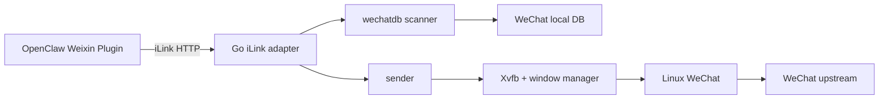

# 架构

`webox` 只解决一个问题：

> 在单个容器里运行 Linux WeChat，并把真实客户端投影成 iLink HTTP 接口。

## 设计原则

1. 对外消息契约只有 iLink；不再提供企业微信 AI Bot WebSocket。
2. 协议模型停留在适配层，微信数据库和 UI 发送逻辑不依赖 iLink 字段。
3. WeChat Linux 客户端是真实终端：收消息读本地 DB，发消息驱动客户端 UI。
4. WeChat DB 是消息事实源，不复制一套业务消息库。
5. 对发送结果采用同步、可验证语义，不在 UI 操作完成前返回成功。

## 组件



## 登录与身份

OpenClaw 通过标准二维码路由发起登录：

```text
get_bot_qrcode
  -> decode QR from Xvfb framebuffer
  -> OpenClaw displays the real WeChat login URL
get_qrcode_status
  -> wait / scaned / confirmed
  -> return persistent bot_token and baseurl
```

二维码会话只确认当前进程实际签发的 ID，未知或超时 ID 返回 `expired`。微信已登录时，只有携带当前本地 token 的客户端能够恢复连接，避免匿名请求直接取得 token。

token、provider account ID 和游标签名密钥分别持久化。`/healthz` 只返回 `ok` 和 `ready`，不暴露这些内部状态。

## 收消息

```text
POST getupdates(get_updates_buf)
  -> verify signed cursor
  -> decrypt and poll new WeChat DB rows
  -> map rows to iLink msgs
  -> issue signed context_token per target
  -> return msgs and next signed cursor
```

首次空游标在当前数据库末尾建立基线，不回放登录前历史。后续长轮询最多等待 35 秒；同一个旧游标可重新读取相同消息，因此消费者使用稳定 `msgid` 去重。

主要字段映射：

| 微信字段 | iLink 字段 |
| --- | --- |
| `msgid` | `msgid`、`client_id`、数值 `message_id` |
| `local_id` | `seq` |
| `from` | `from_user_id`、`ilink_user_id` |
| `roomid` | `session_id`、签名 `context_token` 目标 |
| `msgtime` | `create_time_ms`、`update_time_ms` |
| `text.content` | `text`、`item_list[].text_item.text` |

群聊 `roomid` 以 `@chatroom` 结尾，并额外写入 `group_id`。非文本消息目前转换为可读占位文本。

## 发消息

```text
POST sendmessage(msg.context_token, msg.client_id, text item)
  -> authenticate bot token
  -> verify and decode context_token
  -> check client_id idempotency
  -> resolve recipient and unique remark
  -> activate WeChat, paste and send
  -> read exact text back from the same local DB conversation
  -> cache receipt and return ret=0
```

服务只信任签名 `context_token` 中的目标，不信任调用方可修改的 `to_user_id`。同一 `client_id` 和相同内容重试直接返回第一次结果；同一 ID 携带不同内容会被拒绝。缓存有 1024 条上限，进程重启后清空。

整个发送路径由互斥锁串行化。HTTP 成功表示 UI 发送及数据库回读都已完成，不是“已进入队列”。这使一条 iLink `sendmessage` 精确对应一条微信消息，不存在 WeCom 主动发送与被动流结束的双通道。

## 辅助接口

- `getconfig` 签发绑定用户的 `typing_ticket`。
- `sendtyping` 校验 ticket 后返回 HTTP 501，因为 Linux 微信 UI 没有可靠输入状态动作。
- `notifystart`、`notifystop` 校验身份并返回 `ret=0`。
- 二进制出站 item 返回 HTTP 501，不伪造成功。

## 可靠性边界

- WeChat DB 是持久事件源，不增加独立业务消息库。
- 游标带 HMAC 签名，调用方只能原样回传。
- 进程重启后，空游标从当前数据库末尾建立新基线。
- UI 发送必须从 WeChat DB 验证目标和精确文本后才返回成功。
- `client_id` 处理请求重试；`msgid` 处理入站重复。
- 微信会话退出后，业务接口返回 iLink `ret=-14`，由客户端重新登录。

## 非目标

- 不实现企业微信 AI Bot、XML/Webhook 或通用消息中台协议。
- 不维护独立用户、会话或消息事实库。
- 不从 WeChat 网络流量解析登录或聊天消息。
- 当前不支持二进制媒体传输、文件上传或真实输入状态。

## Go 模块

```text
cmd/weagent       process lifecycle and HTTP server
internal/config   persistent iLink identity and environment configuration
internal/ilink    iLink routes, authentication, mapping and idempotency
internal/qrsource locate login QR from Xvfb framebuffer
internal/wechat   initialization, signed cursor and DB coordination
internal/wechatdb decrypt and poll WeChat local DB
internal/sender   serialized xdotool/xclip text sender and DB verification
```
