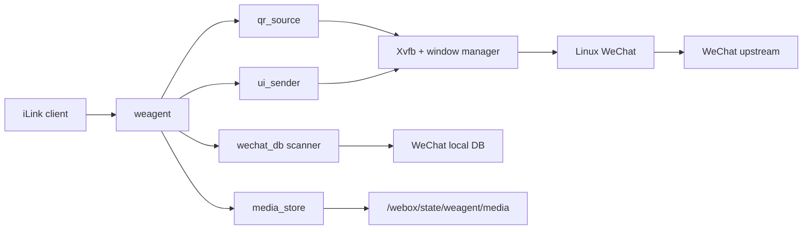

# 架构

`webox` 的目标不是复刻 WechatOnCloud，也不是内置一个通用消息中台。它只解决一个问题：

> 在单个容器里运行 Linux WeChat，并把这个真实客户端投影成标准 iLink 接口。

## 第一性原理

1. 对外契约只有 iLink。
   第三方 AI agent 不应该知道 WOC、tinybridge、msghub 或 `/agent/*`。

2. WeChat Linux 客户端是真实终端。
   发消息通过 UI 自动化驱动客户端；收消息从 WeChat 本地 DB 解密读取。

3. `weagent` 不维护独立消息事实库。
   消息事实源是 WeChat DB；二维码图像事实源是 WeChat 登录窗口；发送任务初版只需要进程内串行执行。

4. 参考项目只提供证据，不决定架构。
   `woc-agent-rs` 参考 WeChat DB 与 UI 自动化能力；`tinyclaw/msghub` 只参考 iLink 交互形状；`aicat` 不进入核心设计。

## 目标态组件



## 运行边界

- `weagent` 暴露 iLink HTTP API。
- `weagent` 从 Xvfb framebuffer 定位、解码并裁剪 WeChat 登录二维码。
- `weagent` 解密并轮询 WeChat 本地 DB，把消息投影成 iLink updates。
- `weagent` 后台状态机独立完成登录后的 DB key 提取和可读性验证；HTTP 请求不触发初始化。
- `weagent` 接收 iLink 发送请求，文本直接串行调用 UI sender，媒体先走本地 CDN shim 上传和解密。
- Docker entrypoint 只负责启动 Display、WeChat 和 weagent。
- WeChat 直接连接上游，不安装 CA、不修改客户端二进制、不注入代理。
- Docker entrypoint 做最小进程监督，关键进程退出时让容器失败，由 Docker restart policy 重启。
- WeChat 客户端在镜像构建期内置，容器运行期不下载或更新客户端。

## 非目标

- 不保留 WOC `/agent/init`、`/agent/poll`、`/agent/send` 作为对外 API。
- 不复制 msghub 的 actor/room/message/task 数据库。
- 不从 WeChat 网络流量解析登录或聊天消息。
- 不把本地媒体上传缓存扩展成通用对象存储或消息附件库。
- 不引入控制面、租户系统、通用消息中台或 AI runner。

## 数据流

### 登录二维码

```text
WeChat login window
  -> Xvfb framebuffer
  -> weagent detects, decodes and crops QR
  -> iLink login QR response
```

- `WEBOX_QR_SCREENSHOT_PATH` 指向 Xvfb framebuffer。只有同时检测到 WeChat 蓝色二维码并由 QR 解码器识别成功时才返回裁剪后的 PNG。
- `GET /get_bot_qrcode` 返回标准 `qrcode` 和 `qrcode_img_content`。
- `GET /get_qrcode_status` 只读取状态；后台初始化器能读取消息后才返回 `confirmed`。
- WeChat 自动刷新二维码时 ID 会随图像变化；旧 ID 查询返回 `expired`，客户端重新获取当前二维码。
- 状态只从本机 WeChat 推导；`binded_redirect`、`need_verifycode` 等远端 iLink 状态不做伪造。
- `confirmed.baseurl` 返回服务根地址，客户端按标准协议拼根路径端点。
- 只暴露标准根路径端点，不保留 `/ilink/bot/*` 或项目早期的自定义 API。
- `weagent` 不保存二维码历史；二维码变化直接反映当前 WeChat 登录窗口。
- 持久账号启动页由后台状态机自动点击登录；微信要求的手机确认仍保持官方安全边界。
- iLink 客户端没有 `/init` 阶段：扫码并确认后，后台自动完成 key 提取与 DB 验证。

### 收消息

```text
WeChat local DB
  -> wechat_db scanner decrypts and polls new rows
  -> normalize to iLink msgs
  -> client pulls through iLink getupdates
```

游标原则：

- 对外只接受 iLink `get_updates_buf`，不暴露内部 DB cursor。
- `get_updates_buf` 是不透明游标，内部只编码最后投递的稳定 update id。
- 每条 `msg` 包含无状态、HMAC 签名的 `context_token`，agent 回复时必须原样传给 `/sendmessage`。
- `msg/notifystart` 和 `msg/notifystop` 接收标准 SDK 生命周期通知，不参与本地 DB 游标。
- 服务端不维护独立 ack 状态。
- 如果标准 iLink 明确要求持久上下文状态，再增加最小状态；不能预先引入 msghub-style mailbox。

### 发消息

```text
iLink sendmessage
  -> validate msg.context_token and text/media payload
  -> media references are decrypted from local CDN shim when present
  -> execute in-process serial send job
  -> ui_sender activates WeChat window
  -> search/open conversation
  -> paste content
  -> click/send
  -> verify the exact text from WeChat local DB
  -> return iLink ret=0
```

初版发送策略：

- 单进程内串行发送，避免多个 UI 操作互相打断。
- 只使用 `msg.context_token` 中的 room target；不接受显式 `msg.to_user_id` 直发，避免绕开 iLink 上下文。
- `context_token` 使用 API token 做 HMAC 签名，不维护服务端 token 表。
- 文本发送必须从 WeChat DB 读回目标和文本均精确匹配的新消息后才成功。
- 不暴露 UI sender receipt；同步执行成功返回 `ret=0`。
- 文本、图片、视频、语音和文件都通过同一个 `sendmessage` 入口；媒体最终落到 Linux WeChat 文件选择器。
- `getconfig`/`sendtyping` 初版只做 iLink SDK 兼容：无状态 `typing_ticket` + no-op `sendtyping`。
- 群聊目标必须使用可唯一定位的备注或会话名，否则拒绝发送。
- 所有发送目标的 UI 搜索词必须在联系人库中精确唯一；同名联系人先设置唯一备注。
- 仅当需要容器重启后恢复 pending send 时，再增加最小本地 spool。

### 媒体上传

```text
iLink getuploadurl
  -> media_store creates pending upload token
  -> client uploads encrypted bytes to /c2c/upload
  -> media_store returns x-encrypted-param reference
  -> sendmessage carries encrypt_query_param + aes_key
  -> media_store decrypts, checks rawsize/rawfilemd5
  -> ui_sender sends the temporary file through WeChat
```

边界：

- `/c2c/upload` 和 `/c2c/download` 是本地 iLink CDN 兼容层，不代理真实微信 CDN。
- 本地只保存 pending metadata 和加密媒体字节；发送时才短暂写出解密文件给文件选择器。
- AES key 接受协议页列出的三种格式：base64 原始 16 字节、base64 十六进制字符串、直接 32 字符十六进制。
- `getuploadurl` 返回 `upload_full_url`，优先兼容会使用该字段的 SDK；只硬编码真实 CDN base 的 SDK 需要适配。

## Rust 模块划分

```text
weagent
  config       environment configuration
  ilink        HTTP wire protocol and response mapping
  qr_source    decode and crop QR from Xvfb framebuffer
  wechat_state derive login state and coordinate DB access
  wechat_db    decrypt and poll WeChat local DB
  media_store  local iLink CDN upload/download shim
  ui_sender    xdotool/xclip based send executor
```

## 自动初始化状态机

```text
container starts
  -> iLink routes listen immediately
  -> wait for QR scan or activate saved-account login
  -> detect logged-in main window
  -> load and validate persisted DB keys, or extract keys from WeChat memory
  -> validate local DB session state
  -> mark ready and return confirmed
  -> getupdates/sendmessage operate without another init call
```

初始化器是唯一允许提取 key 的组件。二维码状态、`getupdates` 和 `sendmessage` 不会隐式触发扫描，避免请求时延和
多个并发请求重复初始化。退出登录后 ready 状态自动清除；再次登录会重新验证或提取 key。

## 实施顺序

1. 移植 `woc-agent-rs` 的 WeChat DB 解密和 UI 发送能力到 `weagent`。
2. 用 Rust 实现 iLink HTTP 外壳，只暴露标准 iLink 和健康检查。
3. 把 WeChat DB scanner 的消息投影成 iLink `msgs`。
4. 把 iLink send 请求接到 UI sender。
5. 从 Xvfb framebuffer 解码并裁剪登录二维码。
6. 整理 Dockerfile 和 entrypoint，保证内置 WeChat、权限和 Display 启动顺序正确。

## 验证状态

- WeChat 4.1.1.7 ARM64 已完成真实容器二维码、登录、内存 key 提取和 15 个本地 DB key 读取验证。
- 标准 `/getupdates` 已用真实消息验证不透明游标、`context_token` 和文本投影。
- 文本 UI 发送原语及发送后 DB 回读已在文件传输助手验证。
- 待完成：签名 `context_token` 后的标准 `/sendmessage` 最终回归、媒体文件选择器回归、真实第三方 iLink SDK 兼容性验证。
