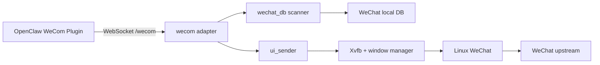

# 架构

`webox` 只解决一个问题：

> 在单个容器里运行 Linux WeChat，并把真实客户端投影成企业微信 AI Bot WebSocket 接口。

## 设计原则

1. 对外消息契约只有企业微信 AI Bot WebSocket JSON 协议。
2. 协议模型停留在适配层，微信数据库和 UI 发送逻辑不依赖企业微信字段。
3. WeChat Linux 客户端是真实终端：收消息读本地 DB，发消息驱动客户端 UI。
4. WeChat DB 是消息事实源，不复制一套业务消息库。
5. 不实现微信无法保证的语义；流式回复降级成最终单条消息。

## 组件



## WebSocket 生命周期

1. 客户端连接 `GET /wecom`。
2. 第一帧必须是 `aibot_subscribe`，Webox 校验 `bot_id` 和 `secret`。
3. Webox 对每个请求原样回传 `headers.req_id`。
4. `ping` 用于应用层心跳。
5. 新连接建立后，同一 Bot ID 的旧连接退出。
6. 数据库轮询游标在进程内跨重连保留。

Webox 默认监听容器内 `0.0.0.0:8080`，Docker 端口默认绑定宿主机 `127.0.0.1`。跨主机部署必须使用反向代理提供 TLS，并更换默认 secret。

## 收消息

```text
WeChat local DB
  -> decrypt and poll new rows
  -> normalize local message
  -> map to aibot_msg_callback
  -> push through WebSocket
```

文本回调映射：

| 微信字段 | 企业微信字段 |
| --- | --- |
| `msgid` | `body.msgid` |
| 私聊 `roomid` | 回复目标，不写入 `body.chatid` |
| 群聊 `roomid` | `body.chatid` |
| `from` | `body.from.userid` |
| `msgtime / 1000` | `body.create_time` |
| `text.content` | `body.text.content` |

`roomid` 以 `@chatroom` 结尾时，`chattype=group`；否则为 `single`。

游标只在 WebSocket 帧写入成功后推进。连接中断可能导致少量重复，但不会因为“先推进、后写入”丢消息；消费者使用稳定 `msgid` 去重。

## 被动回复

OpenClaw 使用原入站 `req_id` 发送 `aibot_respond_msg`：

```text
finish=false -> replace stream cache -> ACK
finish=true  -> send final text through WeChat UI -> ACK
```

企业微信流式帧的 `content` 是累计全文，因此缓存采用覆盖而不是追加。Webox 不向微信发送中间帧，也不显示“思考中”占位。

回复上下文保留 10 分钟。上下文过期、目标缺失或发送队列已满时返回非零 `errcode`，不伪造成功。

## 主动发送

`aibot_send_msg` 支持：

- `body.chatid` 指定微信用户 ID 或群聊 ID。
- `msgtype=text` 的 `text.content`。
- `msgtype=markdown` 的 `markdown.content`，当前按普通文本发送。

发送任务进入有界队列并在进程内串行执行：

```text
aibot_send_msg / final reply
  -> resolve recipient
  -> activate WeChat window
  -> search unique remark
  -> paste and send text
  -> verify exact message in WeChat DB
```

联系人和群聊必须设置唯一备注，确保 UI 搜索第一项就是目标。

WebSocket ACK 表示发送任务已进入 Webox 的有界队列，不表示微信 UI 已完成发送。UI 发送和数据库验证结果写入日志；队列已满时返回非零 `errcode`。这样不会让 OpenClaw 的协议超时绑定到不可控的桌面操作时延。

## 登录与初始化

微信登录不属于消息协议。用户通过 noVNC 查看真实微信客户端并扫码登录。

```text
container starts
  -> /healthz and /wecom listen immediately
  -> wait for QR scan or activate saved-account login
  -> detect logged-in main window
  -> load persisted DB keys or extract keys from WeChat memory
  -> validate local DB
  -> mark ready
```

`/healthz` 只返回 `ok` 和 `ready`，不暴露数据库游标、密钥或账号内部状态。

## 可靠性边界

- WeChat DB 是持久事件源，不增加独立消息队列。
- 进程内游标避免 WebSocket 短暂断线丢消息。
- 进程重启后从当前数据库末尾建立新基线，不回放任意历史消息。
- WebSocket 写入失败不推进游标，重连后允许重复投递。
- UI 发送必须从 WeChat DB 验证目标和文本后才记录成功。
- 不承诺 exactly-once；使用 `msgid` 实现幂等消费。

## 非目标

- 不实现 XML/Webhook、自建应用 HTTP API 或通用消息中台。
- 不实现真实逐字流式微信消息。
- 不维护独立用户、会话或消息事实库。
- 不从 WeChat 网络流量解析登录或聊天消息。
- 当前不支持图片、语音、视频、文件、卡片和输入状态。

## Go 模块

```text
cmd/weagent       process lifecycle and HTTP routes
internal/config   environment configuration
internal/wecom    WebSocket protocol and wire mapping
internal/qrsource locate login QR from Xvfb framebuffer
internal/wechat   initialization, cursor and DB coordination
internal/wechatdb decrypt and poll WeChat local DB
internal/sender   serialized xdotool/xclip text sender
```
