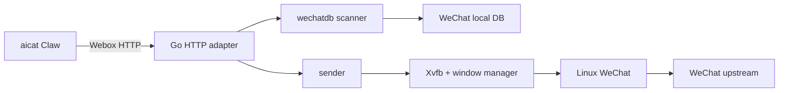

# 架构

`webox` 只解决一个问题：

> 在单个容器里运行 Linux WeChat，并把真实客户端投影成供 aicat 使用的 HTTP 接口。

## 设计原则

1. 对外只保留 aicat 实际使用的 HTTP 接口，不维持通用 iLink 兼容面。
2. 协议模型停留在适配层，微信数据库和 UI 发送逻辑不依赖 HTTP 消息字段。
3. WeChat Linux 客户端是真实终端：收消息读本地 DB，发消息驱动客户端 UI。
4. WeChat DB 是消息事实源，不复制一套业务消息库。
5. 对发送结果采用同步、可验证语义，不在 UI 操作完成前返回成功。

## 组件


```mermaid
flowchart LR
  Aicat["aicat Claw"] -->|"Webox HTTP"| Adapter["Go HTTP adapter"]
  Adapter --> DBScanner["wechatdb scanner"]
  DBScanner --> WXDB["WeChat local DB"]
  Adapter --> UISender["sender"]
  UISender --> Display["Xvfb + window manager"]
  Display --> WeChat["Linux WeChat"]
  WeChat --> WXNet["WeChat upstream"]
```

## 登录与身份

微信登录完全通过 noVNC 桌面手动完成：

```text
noVNC desktop
  -> scan the WeChat QR code or confirm the saved account
  -> initializer observes the main window
  -> extract and persist WeChat DB keys
  -> expose ready=true from /healthz
```

初始化循环不会解析 Xvfb framebuffer，也不会通过固定坐标点击登录按钮。未登录时它只记录一次提示并等待；首次登录、登录失效和已保存账号确认都由使用者在 noVNC 中处理。登录状态和提取出的数据库密钥持久化在 `/webox/state`。

HTTP token 和游标签名密钥分别持久化。Webox 不再生成额外的 provider account ID；登录账号的稳定内部
`account_id` 直接取自 contact 自账号记录的 `username`，不假设它具有 `wxid_` 前缀。受 token 保护的
`GET /ilink/bot/userinfo` 返回必需的 `account_id`、可见且可修改的 `wechat_id`，并在可用时附带
`nickname` 和 `avatar_url`；这些字段来自同一条 contact 记录。`avatar_url` 优先使用 `big_head_url`，
缺失时回退到 `small_head_url`；contact `alias` 为空时，`wechat_id` 回退为当前账号的 `username`。
这里的 `username` 始终作为稳定 `account_id`；部分旧账号的 `username` 恰好与当前可见微信号相同，
但两者语义不同。用户以后修改微信号时，新的可见值进入 `alias`，`account_id` 仍保持原 `username`。
`/healthz` 仍只返回 `ok` 和 `ready`，不暴露这些身份或凭据。

## 收消息

```text
POST getupdates(get_updates_buf)
  -> verify signed cursor
  -> query encrypted WeChat DB and WAL through SQLCipher
  -> map rows to Webox msgs
  -> decode V2 image .dat files into /webox/state/media/inbox
  -> copy available WeChat files into /webox/state/media/inbox
  -> return msgs and next signed cursor
```

首次空游标在当前数据库末尾建立基线，不回放登录前历史。后续长轮询最多等待 35 秒；同一个旧游标可重新读取相同消息，因此消费者使用稳定 `msgid` 去重。
数据库连接由 SQLCipher 保持并直接读取微信的 DB/WAL，不再生成明文数据库缓存。

主要字段映射：

| 微信字段 | Webox 消息字段 |
| --- | --- |
| `msgid` | `msgid` |
| 实际发送者 | `from`；当前账号发出的消息使用登录账号 `account_id` |
| `SessionTable.username` | `roomid`；私聊与群聊都非空 |
| 暂不解析的 @ 接收者 | `tolist=[]` |
| `msgtime` | `msgtime`（毫秒） |
| 文本 | `msgtype=text`、`text.content` |
| 普通链接 `appmsg` | `msgtype=link`、`link` |
| 视频号 `appmsg.finderFeed` | `msgtype=sphfeed`、`sphfeed` |
| 图片 | `msgtype=image`、`image.sdkfileid` |
| 文件 | `msgtype=file`、`file.filename`、`file.sdkfileid` |
| 带引用图片的文本 | `msgtype=mixed`、`mixed.item[]` |

数据库消息直接转换为公开 Go 包 `github.com/netcat-ai/webox/wecom` 的 `Message`。消息信封沿用
[企业微信会话内容存档消息格式](https://developer.work.weixin.qq.com/document/path/91774)的字段形状，但 Webox 将
`roomid` 统一定义为 `SessionTable.username`，并在当前版本固定输出空 `tolist`。消息对象不包含
`item_list`、`context_token`、`mentioned_me`、`is_completed` 或 `shared_path` 等 Webox 私有字段。
媒体在共享目录中的相对路径作为 opaque `sdkfileid` 使用；Webox 不增加另一套路径字段。
视频号分享的 `appmsg` 顶层可能只包含“当前微信版本不支持”的兼容标题和升级 URL；Webox 优先读取
`finderFeed`，输出 `sphfeed` 消息体，不生成 `text`，也不把顶层兼容占位交付给消费者。

群聊 `roomid` 以 `@chatroom` 结尾，其他 `roomid` 表示私聊。图片消息只解码 Linux 微信 V2 `.dat`；已下载文件从微信本地目录复制到
共享目录。媒体可用时 `sdkfileid` 是 `inbox/` 相对路径，不可用时为空字符串。

引用图片使用企业微信 `mixed` 结构：显式文本是 `type=text` item，被引用图片是带 `sdkfileid` 的
`type=image` item。图片尚未准备好时复用当前消息的一分钟媒体等待窗口。

图片优先尝试 `_h.dat`、`.dat`；只有 `_t.dat` 时，从缩略图落盘起等待 3 秒，期间继续重试高清候选，
到期后才使用 `_t.dat` 兜底。图片或文件尚未准备好时，
`getupdates` 不返回当前批次，也不推进 cursor；单次 HTTP 长轮询到期可返回空消息和原 cursor，由消费者继续请求。
从微信消息时间起等待满 1 分钟仍不可用时，Webox 记录 WARN、返回空 `sdkfileid` 的原媒体消息并推进 cursor，避免永久队头阻塞。

V2 `.dat` 外层解密后若得到 `wxgf`，Linux CGO 构建直接加载微信随客户端提供的 `libvoipComm.so` 和
`libvoipCodec.so`，调用 `wxam_dec_wxam2pic_5` 输出 JPEG；加载 codec 前以 `RTLD_GLOBAL` 预载
`libz.so.1`，满足其未自行声明的 zlib 符号依赖。该接收链路不调用 FFmpeg；非 Linux 或关闭 CGO 的构建
会返回明确的不支持错误。

## 发消息

```text
POST sendmessage(msgs[text/image/file...])
  -> authenticate bot token
  -> resolve the common target from roomid
  -> resolve media sdkfileid under /webox/state/media/inbox or outbox
  -> activate WeChat once, paste and press Enter for every message in order
  -> verify every expected text, image, and file in the same local DB conversation
  -> return the first msgid as client_msg_id with ret=0
```

批内所有消息必须拥有相同的非空 `roomid`，且 `tolist` 必须为空。
整个发送路径由互斥锁串行化。一个 `msgs` 数组是一次有序 UI 发送批次：每条文本、图片和文件都通过剪贴板粘贴后立即按 Enter，
不使用附件按钮、文件选择器或坐标点击。该批次不是原子操作，中途失败时前面的消息可能已经发出，调用方不能自动重试整个批次。
HTTP 成功表示全部消息的 UI 发送及数据库回读都已完成，不是“已进入队列”。媒体 API 只传共享目录相对路径，不上传文件、不生成下载 URL。

## HTTP 接口

Webox 只暴露以下接口：

- `GET /healthz`：返回进程存活与微信初始化状态。
- `GET /ilink/bot/userinfo`：返回当前微信账号身份。
- `POST /ilink/bot/getupdates`：长轮询接收消息。
- `POST /ilink/bot/sendmessage`：发送文本、图片和文件。

后三个接口要求 Webox token。语音和视频出站 item 返回 HTTP 501，不伪造成功。

## 可靠性边界

- WeChat DB 是持久事件源，不增加独立业务消息库。
- 游标带 HMAC 签名，调用方只能原样回传。
- 进程重启后，空游标从当前数据库末尾建立新基线。
- UI 发送必须从 WeChat DB 验证目标和精确文本后才返回成功。
- `client_id` 由调用方标识出站消息；`msgid` 处理入站重复。
- 微信会话退出后，业务接口返回 `ret=-14`；使用者通过 noVNC 重新登录。

## 非目标

- 不实现企业微信 AI Bot、XML/Webhook 或通用消息中台协议。
- 不维护独立用户、会话或消息事实库。
- 不从 WeChat 网络流量解析登录或聊天消息。
- 不通过 HTTP 分发登录二维码或管理登录会话。
- 不自动识别、刷新或点击微信登录界面。
- 当前不支持 HTTP 二进制媒体上传或真实输入状态。

## Go 模块

```text
cmd/weagent       process lifecycle and HTTP server
internal/config   persistent HTTP credentials and environment configuration
internal/ilink    HTTP routes, authentication and message mapping
internal/wechat   initialization, signed cursor and DB coordination
internal/wechatdb query encrypted WeChat DB and WAL through SQLCipher
internal/sender   serialized xdotool/xclip text sender and DB verification
```
